# Explainability for Vision Transformers (in PyTorch)

This repository implements methods for explainability in Vision Transformers.

See also https://jacobgil.github.io/deeplearning/vision-transformer-explainability


## Currently implemented:
- Attention Rollout.
- Gradient Attention Rollout for class specific explainability. 
*This is our attempt to further build upon and improve Attention Rollout.*

- TBD Attention flow is work in progress.

Includes some tweaks and tricks to get it working:
- Different Attention Head fusion methods, 
- Removing the lowest attentions. 


## Usage

- From code
``` python
from vit_grad_rollout import VITAttentionGradRollout

model = torch.hub.load('facebookresearch/deit:main', 
'deit_tiny_patch16_224', pretrained=True)
grad_rollout = VITAttentionGradRollout(model, discard_ratio=0.9, head_fusion='max')
mask = grad_rollout(input_tensor, category_index=243)

```

- From the command line:

```
python vit_explain.py --image_path <image path> --head_fusion <mean, min or max> --discard_ratio <number between 0 and 1> --category_index <category_index>
```
If category_index isn't specified, Attention Rollout will be used,
otherwise Gradient Attention Rollout will be used.

Notice that by default, this uses the 'Tiny' model from [Training data-efficient image transformers & distillation through attention](https://arxiv.org/abs/2012.12877)
 hosted on torch hub.

## Where did the Transformer pay attention to in this image?

| Image | Vanilla Attention Rollout  |  With discard_ratio+max fusion |
| -------------------------|-------------------------|------------------------- |
|  | 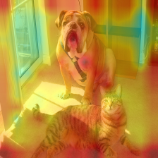 | 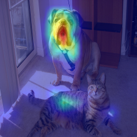
 |  |  |
 | 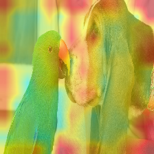 | 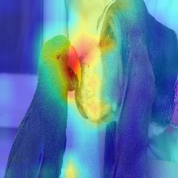 |
 | 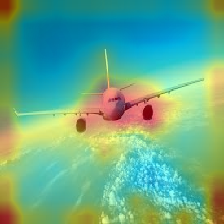 | 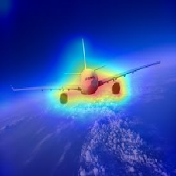 |

## Gradient Attention Rollout for class specific explainability

The Attention that flows in the transformer passes along information belonging to different classes.
Gradient roll out lets us see what locations the network paid attention too, 
but it tells us nothing about if it ended up using those locations for the final classification.

We can multiply the attention with the gradient of the target class output, and take the average among the attention heads (while masking out negative attentions) to keep only attention that contributes to the target category (or categories).


### Where does the Transformer see a Dog (category 243), and a Cat (category 282)?
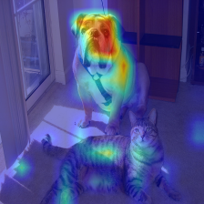 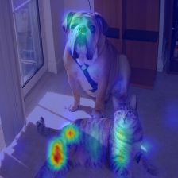

### Where does the Transformer see a Musket dog (category 161) and a Parrot (category 87):
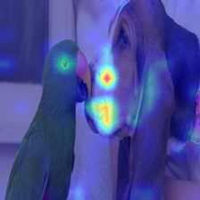 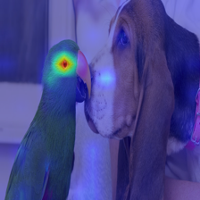


## Tricks and Tweaks to get this working

### Filtering the lowest attentions in every layer

`--discard_ratio <value between 0 and 1>`

Removes noise by keeping the strongest attentions.

Results for dIfferent values:

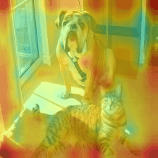 

### Different Attention Head Fusions

The Attention Rollout method suggests taking the average attention accross the attention heads, 

but emperically it looks like taking the Minimum value, Or the Maximum value combined with --discard_ratio, works better.

` --head_fusion <mean, min or max>`

| Image | Mean Fusion  |  Min Fusion |
| -------------------------|-------------------------|------------------------- |
 |  | 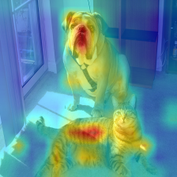

## References
- [Quantifying Attention Flow in Transformers](https://arxiv.org/abs/2005.00928)
- [timm: a great collection of models in PyTorch](https://github.com/rwightman/pytorch-image-models)
and especially [the vision transformer implementation](https://github.com/rwightman/pytorch-image-models/blob/master/timm/models/vision_transformer.py)

- [An Image is Worth 16x16 Words: Transformers for Image Recognition at Scale](https://arxiv.org/abs/2010.11929)
- Credit for https://github.com/jeonsworld/ViT-pytorch for being a good starting point.

## Requirements
`pip install timm`
